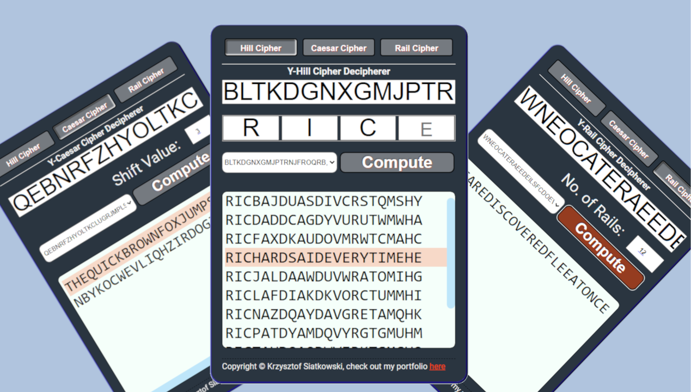

<!--
{
  "meta":
  {
    "type": "WebAppFULLSTACK",
    "ready": true,
    "version": "1.0.1",
    "main":
    [
      "Cryptography",
      "Ciphers"
    ],
    "tags":
    [
      "JavaScript",
      "CSS",
      "WebDevelopment",
      "NodeJS",
      "React",
      "UX",
      "GitHub",
      "FrontEnd",
      "BackEnd",
      "REST",
      "Express",
      "API",
      "Mathematics"
    ],
    "satisfaction": "4",
    "difficulty": "2",
    "challange": "3",
    "complexity": "4"
  }
}
-->

# Y-Cipher-Decipherer

Application deciphering coded messages with Hill Cipher, Caesar Cipher, and
Rails Cipher, created for assignment submission in the first year of a Mathematics
BCs course in computing module. Application made with React for Front-End and NodeJS
with Express for Back-End

## Stack

- _React_ **18.2**
- _NodeJS_ **16.13**
- _Express_ **4.18**

## Background

Application created for purpose of 1st year Mathematics Course - Thinking Like A
Programmer Module (Computing Module).

Course-work expected us to create a script reading message encoded with Hill
Cipher using Matlab or Python. For purposes of personal developement, and since at 
the time I was learning **JavaScript** and **NodeJS**, I decided to take the assignment 
a step further and develop an app levereging on these technologies. 

Initially, I also created GUI in vanilla JavaScript, with a bit of an outdated design. 
While learning React with an Udemy course, I decided to refresh the GUI and fix all the 
issues that API had, including bottling up code and optimising by reducing the operation 
count (Big O). Also imporving the code structure and applying newly learned techiniques.

### Ciphers

Application can decipher a selection of Ciphers:

- Hill Cipher (Special case using 2 by 2 matrix)

- Caesar Cipher

- Rails Cipher

## Mathematics

Mathematics behind the hill cipher revolve around mathematics of modulus.
Modulus is branch of mathematics with operations revolved around division
remainders. English alphabet is a special and very unfavourable case of modulus, 
as there is 26 letters in the alphabet, and it is not a prime number. 

26 can be divided by 13, meaning that there are 2 possible values for each letter 
(eg. A can take value of 1 and 13, and so can M). Initially the problem behind the 
modulus mathematics was solved by a clever but expensive mathematical equation (further problems
are introduced by the modulus of fractions and modulus of negative numbers, which is solved differently
than regular modulus). In new solution, problem was reduced in size by more than half and most of the issues were
solved by operationally cheap lookup tables.

Another important mathematics field that is included in Hill Cipher is linear algebra, and matrix multiplication, 
which basic cases are covered by simple equation. 

More readup:
https://en.wikipedia.org/wiki/Hill_cipher

## Features

UI follows the basic principles of the React code guides and modern responsive and accessible principles.
- Responsive UI
- **ARIA** Support
- React Application

The API is levereging asynchronous execution where applicable which massively speeds up the code.
- Asynchronous Execution
- REST architecture
- Node JS on Express

## Manual

Entering the application you will have option to select the cipher at the top of the application, 
then you will be able to enter the coded message - that is universal for all ciphers. 

Then options depending on the cipher:
- Ceasar Cipher will let you enter the shift value as a number
- Rail Cipher will let you enter the number of rails to use for the coded message
- Hill Cipher will let you enter the (optional) letters of deciphered message, up to 4 characters,
  allowing for substitution any missing values by the entire alphabet

Next, there are sample inputs, collected from various websites or designed by me - also ones that were a 
part of original assignment.

To compute the values press compute button and see the output in compute window below.

## Deployment and Usage

To use the cipher with the API provided, navigate to "path/to/the/project/y-cipher-decipherer/y-cipher-decipherer-ui" and type "npm start", it will open react app on the port 3000 (as defaulted by React).

Then, you will need in the separate command window, navigate to "path/to/the/project/y-cipher-decipherer/y-cipher-decipherer-api", and type "npm run dev", it will start the api on the port 8000.

Now you can use the application, or api as a standalone. Editing default port for React to use as api can be done via setting environmental variable (DECIPHERER_BACKEND) or by editing the Constants.js file in "path/to/the/project/y-cipher-decipherer/y-cipher-decipherer-ui/src/Constants.js", and editing default port in the API can be done by editing "path/to/the/project/y-cipher-decipherer/y-cipher-decipherer-api/app.js"

## Final Words

The assignment on revision was quite dated, when testing it did not produce a correct output for 
all assigned values (in the assignment) and the original answer sheet was lost, therefore not all 
sample input produces correct solution - that is something I plan to look on in a free time.  

I like rating my work and summarizing my accomplishments; therefore as a part of gamification of my work 
I assigned the following scores to this project, with I justified to myself as follows:

- Satisfaction: 4 The project, although was very satisfying when I first worked
  on it, now seems to be lacking. It is not a new project, therefore the
  satisfaction score is biased by the prism of projects I worked on since then.
- Difficulty: 2 Although learning this project was fairly difficult, it has
  hardly anything more than a boilerplate code. Deciphering attempted ciphers is
  a polynomial problem and the algorithms are well covered in various pieces.
  CreateReactApp and React code included is also very basic.
- Challange: 3 The project was not very challenging, learning new technologies
  turned out to be very simple. Attempt to follow the best practices upped the
  challange slightly.
- Complexity: 4 The project uses 3 different algorithms and React with couple of
  custom hooks. The codebase is relatively small, and the project is not
  extended of any extra functionality.
